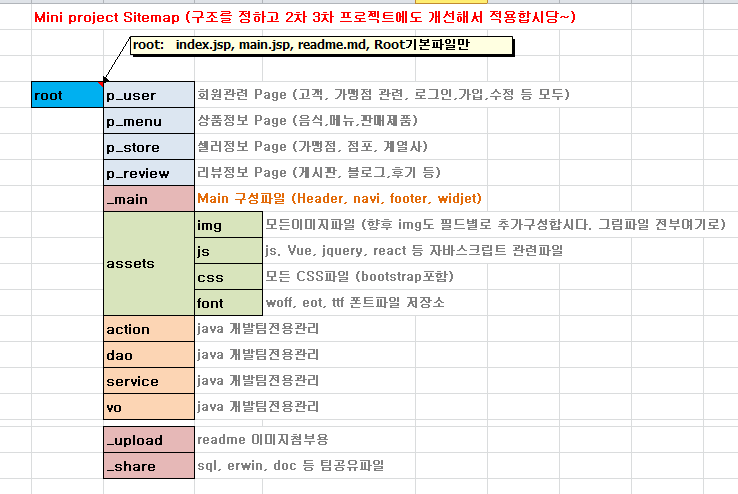

최병훈  
2024.01.24 AM 05:00  

# .1.24 폴더구조변경은 확정이 아니며 사본입니다 원본은 기존 root에 있어요. 
# 폴더변경된 구조로 진행할지 하던대로 할지 정해서 하던대로 하자 하면 
# 추가생성한 폴더는 삭제하면 됩니당~~ 제가 내용수정한 파일은 jsp, html 링크만.

Tree구조 변경중 오전중에 끝낼예정 / 기존파일은 root폴더 내에 그대로 있음.
 

# 요로케 변경할까요?

최시환
- 2024.01.23 PM 11:50
coupon VO,DAO 및 root폴더 하위에 필요 임시 coupon jsp생성 , jps로 임시 관리자버튼 만들어서 coupon INSERT기능 및 삭제버튼 구현
추후에 coupon CRUD 및 관리자 coupon 추가할 예정
login 기능 , 회원가입 기능 경로 연결 잘못되어 있어서 경로 설정(+회원가입은 test_signup.jsp 없길래 sighup.jsp로 설정)

백상희
- 2024.01.23 PM 10:09 navi.jsp 수정
- 2024.01.23 PM 10:09 login.html  수정
- 2024.01.23 PM 10:09 signup.html  회원가입에 대한 폼 부분 수정
- 2024.01.23 PM 10:09 memberVo, action에 대한 파일 업로드

최병훈 
- 2024.01.23 PM 05:43 menu_intro.jsp 파일추가 (assets/img/brand/ 음식사진,타이틀이미지 추가 )
- 2024.01.23 PM 04:05 nav.jsp 네비게이션 바 2중으로 나와서 파일에 직접 수정 - 최병훈
- 2024.01.23 AM 11:15 - index.html은 사용하지 않아 삭제 - 최병훈
index.jsp가 메인 파일이에요~

# 2024.01.23 AM 05:34 File Update

index.jsp로 변경 (UI수정, 지저분한 코드정리, incrude 방식으로 적용)
- header.jsp
- navi.jsp
- footer.jsp

% asset 폴더 다시 받으세욥. CSS, img 수정

- signup.html 수정 (DB col name 맞춤) - jsp로 변경예정
- index.html 수정 (보관용)

----------------------------------------------------------
# miniproject1

첫번째 미니프로젝트 2024.01.22 ~ 01. 30 

